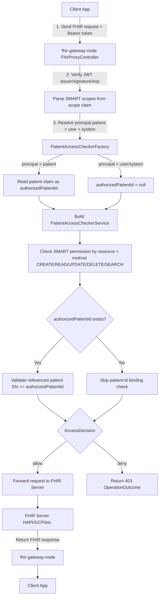

# fhir-gateway-node

`fhir-gateway-node` 是以 Elysia + TypeScript 實作的 FHIR Information Gateway（Node 版本），目標對齊原始 Java 專案行為。

原 Java 專案：[`fhir-gateway`](https://github.com/ohs-foundation/fhir-gateway)

## Keycloak（SMART on FHIR）

本專案搭配的 Keycloak SPI 專案為 [`zedwerks/keycloak-smart-fhir`](https://github.com/zedwerks/keycloak-smart-fhir)。

- realm 請使用 `smart`
- patient-based flow 需使用 `patient` claim（JWT claim key: `patient`）

## Identity Provider（驗簽金鑰來源）

gateway 啟動時只抓一次 `TOKEN_ISSUER` + `WELL_KNOWN_ENDPOINT` 的 OIDC discovery document，這份文件同時用於取得驗簽金鑰與代理 `.well-known/smart-configuration`。驗簽金鑰的取得方式由 `SIGNING_KEY_SOURCE` 決定：

| 值 | 行為 |
| --- | --- |
| `auto`（預設） | 先用 discovery document 的 `jwks_uri`；取不到就退回 legacy `public_key` |
| `jwks` | 只走標準路徑；discovery document 沒有 `jwks_uri` 時啟動失敗 |
| `keycloak-public-key` | 只走 legacy 路徑；issuer root URL 沒有 `public_key` 時啟動失敗 |

- `jwks`（標準路徑）：以 `jwks_uri` 的 JWKS 驗簽，依 token 的 `kid` 選金鑰。任何標準 OIDC provider（Keycloak、Logto、Casdoor、Auth0、Entra…）都可直接使用。
- `jwks` 路徑支援**金鑰輪替**：遇到 token 帶了 gateway 尚未見過的 `kid` 時，會重新抓一次 JWKS 再選一次金鑰，因此 IdP 換金鑰不需重啟 gateway。IdP 在重新抓取期間連不上時該請求以 401 收場。
- 未知 `kid` 的重新抓取有**速率上限**：`jose` 是以**未驗證**的 protected header 選金鑰，因此任何語法合法的 JWT 帶著任意的 `kid` 都會觸發重新抓取。gateway 在 60 秒內最多為 5 個未知 `kid` 對外抓取 JWKS，超過就直接 401（不再對外連線）；時間窗過去後恢復正常輪替。
- `kid` 缺漏時：JWKS 只發布**一把**可用金鑰就用它驗簽（與 legacy `keycloak-public-key` adapter 忽略 `kid` 的行為一致）；發布**多把**時無法唯一決定用哪一把驗簽，一律 401。
- `keycloak-public-key`（legacy adapter）：GET `TOKEN_ISSUER` 的 **root URL**，解析 Keycloak 專屬的 `public_key`（base64 SPKI DER）。保留給既有 Keycloak 部署。
- 明確選擇的路徑不可用時**不會**靜默退回另一條路徑，啟動會直接失敗並在訊息中指名 `SIGNING_KEY_SOURCE`。
- IdP 無法連線時會依啟動重試（3 次）後失敗。抓 OIDC discovery document 失敗時訊息指名 `TOKEN_ISSUER`；抓 `jwks_uri` 失敗時訊息指名 `SIGNING_KEY_SOURCE`（因為出問題的是驗簽金鑰來源），兩者都附上原始原因。

仍為 Keycloak 專屬的設定：`ALLOW_TOKEN_ISSUER_HOST_MISMATCH`（依 Keycloak 的 `/realms/<name>` 路徑判斷 issuer 等價）。`TOKEN_ISSUER` 與 `WELL_KNOWN_ENDPOINT` 則是標準 OIDC 設定。

### Issuer 比對（IssuerPolicy）

「這個 gateway 信任哪些 issuer」由單一 `IssuerPolicy` 決定，依下列順位套用三個具名策略，先接受者勝出：

1. **精確比對**：JWT 的 `iss` 與 `TOKEN_ISSUER` 完全相同即接受（`ALLOW_TOKEN_ISSUER_HOST_MISMATCH` 開啟時仍走這一條）。
2. **開發模式容忍**：`RUN_MODE=DEV` 時接受不同的 `iss`，印出警告後以 token 自己的 issuer 驗簽（Android emulator 會帶不同 issuer）。
3. **Keycloak realm pathname 等價**（**Keycloak 專屬**）：`ALLOW_TOKEN_ISSUER_HOST_MISMATCH=true` 時，若兩個 issuer URL 的 pathname 相同即視為等價，印出警告後以 token 自己的 issuer 驗簽。這是對 Keycloak 把 realm 名稱放在 URL path（`/realms/<name>`）的假設，**不是**通用的 issuer 等價規則。

三個策略都不接受時回 401。策略只透過 `IssuerPolicy` 介面使用，其他呼叫端無法繞過 policy 單獨套用。

## SMART Scopes 的兩種交付形式（ScopeResolver）

IdP 交付 SMART scopes 有兩種標準化形式，gateway 兩種都接受，由單一 `ScopeResolver` 正規化後交給 access checker：

| 形式 | claim | 說明 |
| --- | --- | --- |
| 空白分隔字串 | `scope` | OAuth 2.0 標準形式，也是現行 Keycloak 部署的行為 |
| 字串陣列 | `scp` | RFC 9068 標準形式，多數其他 IdP 預設採用 |

- **兩者並存時以 `scp` 為準**：`scp` 是 RFC 9068 的標準形式，IdP 同時發出兩者等同於刻意宣告採用新形式。
- **兩種形式的每一個 entry 都走同一套 SMART v2 文法驗證**（`src/services/smart-scope.service.ts`），接受陣列形式**不會**放寬可接受的 scope 字串集合；不符合文法的 entry 一律略過。
- **v1 `read`/`write` 到 `cruds` 的相容處理在 resolver 內完成**（`read` → READ + SEARCH，`write` → CREATE + UPDATE + DELETE），因此 access checker 只看得到已解析的 v2 permissions，不會讀 scope claim。

## Basic Access Checker（跨 principal 合併 CRUDS）

`ACCESS_CHECKER=basic` 時：

- JWT 必須含至少一個 SMART FHIR scope（`patient/`、`user/` 或 `system/`）
- 不區分 principal level，將所有 scope 的 cruds 權限做 union 後依 HTTP method 驗證
- 不檢查 `patient` claim 或病人參照

## Patient Access Checker Flow（SMART Patient-specific scopes）

`ACCESS_CHECKER=patient` 時，gateway 會依 SMART scope principal 決定授權模式：

- scope 含 `patient/...`：使用 patient-specific 授權（需要 `patient` claim）
- scope 只有 `user/...` 或 `system/...`：僅做 SMART scope CRUDS 權限檢查（不綁單一病人）

流程圖（client 到 FHIR server）：



## 如何寫 Access Checker

Access Checker 是 gateway 在 JWT 驗證通過、且 Allowed Queries 未放行後，決定「這個請求能否轉發到 FHIR backend」的插件。設計對齊 Java 版 `@Named` AccessChecker 插件模型。

### 核心介面

| 類型 | 說明 |
| --- | --- |
| `AccessChecker` | 每個請求建立一個實例；實作 `checkAccess(request)`，可選實作 `prepare(request)`（見下方 [fhirBackend](#access-checker)） |
| `AccessCheckerFactory` | thread-safe；從 LaunchContext 等 context 建立 `AccessChecker` |
| `AccessCheckerCreateContext` | Factory 可用依賴：`launch`、`patientFinder`、（選用）`fhirBackend` |
| `FhirRequestDetails` | 請求摘要：`requestPath`、`requestType`、`queryParams`、`requestBody?` |
| `AccessDecision` | 授權結果；可選附帶 mutation / postProcess / audit user |
| `LaunchContext` | verified token 轉譯出的 IdP 中立 DTO：`subject`、`patientId?`、`patientListId?`、`scopes`、`agent` |
| `LaunchContextProvider` | 由 verified token 建立 `LaunchContext`；**唯一**知道 claim 名稱的地方 |
| `ScopeResolver` | 由 token claims 解析 SMART scopes；接受 `scope` 字串與 RFC 9068 `scp` 陣列兩種標準形式 |

請求處理順序（`FhirProxyController`）：

1. `metadata` → 無需 JWT，直接放行
2. Allowed Queries（未驗證）→ 請求符合 allow-list 中標記 `allowUnauthenticatedRequests` 的項目時，**直接放行**（不需 JWT，也不執行 Access Checker）
3. JWT 驗證 → 上一步未放行時，必須提供有效 Bearer token
4. Allowed Queries（已驗證）→ 請求符合 allow-list 任一項目時，**直接放行**（仍須 JWT，但不執行 Access Checker）
5. **`accessCheckerRegistry.create(ACCESS_CHECKER, context)` → `checkAccess()`** → 前兩步 allow-list 皆未放行時才執行
6. 若 `canAccess()` 為 `false` → 403；否則套用 `getRequestMutation` 後轉發
7. 回應後執行 `postProcess`（若有）

### 最小範例

```typescript
// src/services/access-checkers/my-access-checker.service.ts
import type { AccessChecker, AccessCheckerCreateContext, AccessCheckerFactory } from "../../types/access-checker";
import { accessGranted, accessDenied } from "../../types/access-decision";
import type { FhirRequestDetails } from "../../types/fhir-request";
import { parseResourcePath } from "../../utils/fhir.util";

class MyAccessCheckerService implements AccessChecker {
    checkAccess(request: FhirRequestDetails) {
        const { resourceName } = parseResourcePath(request.requestPath);
        if (resourceName === "Patient" && request.requestType === "GET") {
            return accessGranted();
        }
        return accessDenied();
    }
}

export const myAccessCheckerFactory: AccessCheckerFactory = {
    create(_context: AccessCheckerCreateContext): AccessChecker {
        return new MyAccessCheckerService();
    },
};
```

### 註冊自訂 Checker

**方式 A — 啟動時注入 registry（建議）**

```typescript
import { createApp } from "./app";
import { createDefaultAccessCheckerRegistry } from "./services/access-checker-registry.service";
import { myAccessCheckerFactory } from "./services/access-checkers/my-access-checker.service";

const registry = createDefaultAccessCheckerRegistry();
registry.register("my-checker", myAccessCheckerFactory);

createApp({ tokenVerifier, config: { ...config, accessChecker: "my-checker" }, accessCheckerRegistry: registry });
```

**方式 B — 修改 `createDefaultAccessCheckerRegistry()`**

在 `src/services/access-checker-registry.service.ts` 加入 `registry.register("my-checker", myAccessCheckerFactory)`，並設定 `ACCESS_CHECKER=my-checker`。

> `ACCESS_CHECKER` 可為任意非空字串；啟動時 registry 必須已註冊對應名稱，否則請求會回 401。

### AccessDecision 進階能力

除 `canAccess()` 外，可選實作：

| 方法 | 用途 |
| --- | --- |
| `getRequestMutation` | 轉發前修改 query params（新增 / 移除） |
| `postProcess` | 收到 backend 回應後修改 body（例如 List checker 在 POST Patient 成功後更新 List） |
| `getUserWho` | 自訂 AuditEvent 的 agent；預設由 controller 從 JWT 推斷 |

輔助函式（`src/types/access-decision.ts`）：

- `accessGranted()` / `accessDenied()` — 最簡單的 allow / deny
- `accessDecisionWithMutation(granted, getMutation)` — 帶 query mutation 的決策
- `noOpAccessDecision(granted)` — 無 side effect 的決策

### Factory 常用依賴

**LaunchContext**

```typescript
const scopes = context.launch.scopes;
const patientId = context.launch.patientId; // string | undefined
const patientListId = context.launch.patientListId; // string | undefined
const agent = context.launch.agent; // { authorizedParty?, issuer?, tokenId?, subject?, displayName? }
```

Access checker **不得**直接讀 raw JWT claims；claim 名稱只存在於 `LaunchContextProvider`（`src/services/launch-context.service.ts` 的 `LAUNCH_CLAIM_NAMES`）。自訂 checker 需要新的 token 欄位時，擴充 `LaunchContext` 與 provider，不要在 checker 裡加 `payload[claim]`。

Launch context 欄位缺少或格式錯誤時拋 `AuthenticationError`（回 401），訊息會命名缺少的邏輯欄位；請求格式錯誤拋 `InvalidRequestError`（回 400）。

**PatientFinder**

從 query params、request body、Bundle 或 PATCH 中找出涉及的 Patient ID：

```typescript
const patientIds = context.patientFinder.findPatientsForAccessCheck(
    request.requestPath,
    request.queryParams,
);
const bodyPatients = context.patientFinder.findPatientsInResource(
    request.requestPath,
    request.requestBody ?? "",
);
```

**fhirBackend**（非同步，供 checker 在授權前查詢 backend）

若 checker 需在授權階段查詢 backend（如 `list` checker 驗證 FHIR List membership），Factory 可取用 context 的 `fhirBackend`。`checkAccess` 是同步契約，因此實際的 backend 請求發生在 `AccessChecker.prepare(request)`：`FhirProxyController` 在 `checkAccess` 前 `await` 它，內建的 `list` checker 以 `CachedFhirClient` 預載同步判斷所需的全部查詢結果；預載後仍查不到的查詢一律走拒絕路徑。單元測試可直接注入同步 mock client（參考 `tests/helpers/mock-http-fhir-client.ts`）。

預載時同時對外發出的查詢有上限（每次 8 筆），避免單一 transaction bundle 帶入數百個 patient 就驅動同等數量的並行 backend 請求。

`ACCESS_CHECKER=list` 之外，若自訂 checker 也要在授權階段查 backend，`createApp` 預設不會為它建立 `FhirBackendService`；請在建構時自行注入 `fhirBackend`。

**GCP 部署的 backend 憑證**

`BACKEND_TYPE=GCP` 時，轉發請求、list mode 的 FHIR List membership 查詢、以及把新建成 Patient 加回 access List 的 PATCH，都使用同一組 ADC（Application Default Credentials）access token。token 會過期，因此每次請求前重新解析。

**SMART Scope**

內建 `patient` / `basic` checker 使用 `smart-scope.service.ts` 解析 scope 與 CRUDS 權限，自訂 checker 可重用 `SmartScopeChecker`、`MergedSmartScopeChecker`。

### 錯誤處理慣例

| 拋出 | HTTP | 情境 |
| --- | --- | --- |
| `AuthenticationError` | 401 | Launch context 欄位缺失、scope 不足、Factory 初始化失敗 |
| `InvalidRequestError` | 400 | 請求 body / path 無法解析 |
| `accessDenied()` | 403 | 授權邏輯判定拒絕（不拋例外） |

### 內建 Checker 一覽

| 名稱 | `ACCESS_CHECKER` | 說明 |
| --- | --- | --- |
| Permissive | `permissive` | DEV only；有效 JWT 即放行 |
| List | `list` | 依 launch context 的 patient-list id 限制可存取的 Patient 集合 |
| Patient | `patient` | SMART patient/user/system scope + launch context 的 patient id 綁定 |
| Basic | `basic` | SMART scope CRUDS 合併檢查，不綁 patient |

實作參考：

- 最簡：`src/services/access-checkers/permissive-access-checker.service.ts`
- SMART scope：`src/services/access-checkers/basic-access-checker.service.ts`
- Patient 綁定：`src/services/access-checkers/patient-access-checker.service.ts`
- postProcess + backend 查詢：`src/services/access-checkers/list-access-checker.service.ts`

## 環境變數（Environment Variables）

先複製範例檔：

```bash
cp env.example .env
```

必要變數：

- `PROXY_TO`：FHIR backend base URL（例如 `http://localhost:8081/fhir`）
- `TOKEN_ISSUER`：OIDC issuer URL（例如 `http://localhost:9080/realms/smart`）
- `BACKEND_TYPE`：`HAPI` 或 `GCP`
- `ACCESS_CHECKER`：`list`、`patient`、`basic` 或自訂 checker

常用選填：

- `RUN_MODE`：`PROD`（預設）或 `DEV`（容忍 JWT `iss` 與 `TOKEN_ISSUER` 不同）
- `SIGNING_KEY_SOURCE`：驗簽金鑰來源（trust path）：`auto`（預設）、`jwks`、`keycloak-public-key`。見 [Identity Provider（驗簽金鑰來源）](#identity-provider驗簽金鑰來源)
- `ALLOW_TOKEN_ISSUER_HOST_MISMATCH`：**Keycloak 專屬**。`true` 時，PROD 下允許 JWT `iss` 的 host 與 `TOKEN_ISSUER` 不同、但 realm path 相同（預設 `false`）
- `PORT`：HTTP listen port（預設 `3000`）
- `WELL_KNOWN_ENDPOINT`：預設 `.well-known/openid-configuration`
- `ALLOWED_QUERIES_FILE`：Allowed Queries JSON 檔案路徑（見下方 [Allowed Queries 設定檔](#allowed-queries-設定檔)）
- `AUDIT_EVENT_ACTIONS_CONFIG`：AuditEvent action code 字串（例如 `CRUDE`）

## Allowed Queries 設定檔

Allowed Queries 是 query allow-list：請求的 path、HTTP method、query params 符合某個 entry 時，gateway **直接放行**，不執行 Access Checker（未驗證 entry 另可跳過 JWT）。對齊 Java 版 `AllowedQueriesConfig`。

### 啟用方式

`.env` 設定 `ALLOWED_QUERIES_FILE` 指向 JSON 檔：

```bash
ALLOWED_QUERIES_FILE=src/resources/hapi_page_url_allowed_queries.json
```

未設定或留空 → Allowed Queries **停用**，所有非 `metadata` 請求都走 JWT + Access Checker。

### 檔案放置位置

路徑為**程序啟動時的工作目錄（CWD）**下的相對路徑，或絕對路徑。

| 情境 | 建議位置 | 範例 |
| --- | --- | --- |
| 本機開發 | 專案內 `src/resources/` | `src/resources/hapi_page_url_allowed_queries.json` |
| 自訂設定 | 任意可讀路徑 | `/etc/fhir-gateway/allowed-queries.json` |
| Docker | image 內 `src/resources/`（Dockerfile 已 COPY） | `src/resources/hapi_page_url_allowed_queries.json` |

> 本機請在 `fhir-gateway-node/` 目錄下執行 `pnpm dev` / `pnpm start`，相對路徑才會正確解析。

repo 內建範例：`src/resources/hapi_page_url_allowed_queries.json`（HAPI 分頁 `_getpages` URL）。更多範例見 `tests/fixtures/allowed-queries/`。

### JSON 格式

根物件必須含 `entries` 陣列；每個 entry 描述一組允許的請求條件：

```json
{
    "entries": [
        {
            "path": "",
            "queryParams": {
                "_getpages": "ANY_VALUE"
            },
            "allowExtraParams": true,
            "allParamsRequired": true
        }
    ]
}
```

### Entry 欄位

| 欄位 | 必填 | 預設 | 說明 |
| --- | --- | --- | --- |
| `path` | 是 | — | FHIR 相對路徑（不含 `/fhir` prefix）。空字串 `""` 表示根路徑。結尾 `/ANY_VALUE` 可匹配子路徑（如 `Composition/ANY_VALUE` → `Composition/abc`） |
| `queryParams` | 否 | `{}` | 必須匹配的 query param。值為 `"ANY_VALUE"` 表示該 key 存在即可、不限值 |
| `requestType` | 否 | 不限 | HTTP method（大小寫不敏感，如 `"GET"`） |
| `allowExtraParams` | 否 | `false` | `true` 時允許請求帶 entry 未列出的額外 query param |
| `allParamsRequired` | 否 | `false` | `true` 時 entry 列出的 query param 全部必須存在；`false` 時只檢查請求中已出現的 param |
| `allowUnauthenticatedRequests` | 否 | `false` | `true` 時符合此 entry 的請求**不需 JWT** 即可放行 |

### 常見範例

**HAPI 分頁 URL（根路徑 + `_getpages`）**

```json
{
    "entries": [
        {
            "path": "",
            "queryParams": { "_getpages": "ANY_VALUE" },
            "allowExtraParams": true,
            "allParamsRequired": true
        }
    ]
}
```

**允許未驗證存取特定資源 search**

```json
{
    "entries": [
        {
            "path": "Composition",
            "allowUnauthenticatedRequests": true,
            "queryParams": { "_getpages": "ANY_VALUE" }
        }
    ]
}
```

**限制 HTTP method + 禁止額外 param**

```json
{
    "entries": [
        {
            "path": "Encounter",
            "requestType": "GET",
            "queryParams": {},
            "allowExtraParams": false
        }
    ]
}
```

### 與授權流程的關係

- entry 設 `allowUnauthenticatedRequests: true` → 步驟 2 直接放行（無 JWT、無 Access Checker）
- 其餘 entry → 須 JWT，步驟 4 匹配後直接放行（跳過 Access Checker）
- 皆不匹配 → 進入 Access Checker

## 本機啟動（Local Development）

```bash
pnpm install
pnpm dev
```

Build 與執行：

```bash
pnpm build
pnpm start
```

## docker-compose 對接

若你使用 repo 根目錄的 `docker-compose.yaml`，可新增或替換 service 指向 `fhir-gateway-node`：

```yaml
services:
  fhir-gateway-node:
    build:
      context: ./fhir-gateway-node
      dockerfile: Dockerfile
    ports:
      - "3000:3000"
    environment:
      - PROXY_TO=http://host.docker.internal:8081/fhir
      - TOKEN_ISSUER=http://host.docker.internal:9080/realms/smart
      - BACKEND_TYPE=HAPI
      - ACCESS_CHECKER=patient
      - RUN_MODE=DEV
```

啟動：

```bash
docker compose up --build fhir-gateway-node
```
