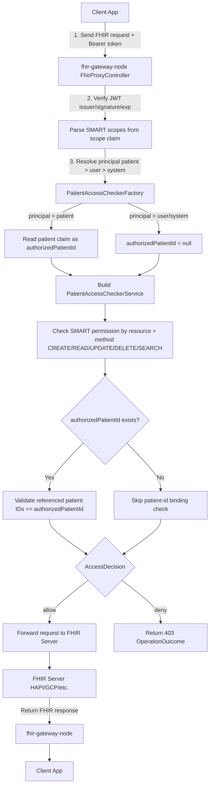

# fhir-gateway-node

`fhir-gateway-node` 是以 Elysia + TypeScript 實作的 FHIR Information Gateway（Node 版本），目標對齊原始 Java 專案行為。

原 Java 專案：[`fhir-gateway`](https://github.com/ohs-foundation/fhir-gateway)

## Keycloak（SMART on FHIR）

本專案搭配的 Keycloak SPI 專案為 [`zedwerks/keycloak-smart-fhir`](https://github.com/zedwerks/keycloak-smart-fhir)。

- realm 請使用 `smart`
- patient-based flow 需使用 `patient` claim（JWT claim key: `patient`）

## Patient Access Checker Flow（SMART Patient-specific scopes）

`ACCESS_CHECKER=patient` 時，gateway 會依 SMART scope principal 決定授權模式：

- scope 含 `patient/...`：使用 patient-specific 授權（需要 `patient` claim）
- scope 只有 `user/...` 或 `system/...`：僅做 SMART scope CRUDS 權限檢查（不綁單一病人）

流程圖（client 到 FHIR server）：



## 環境變數（Environment Variables）

先複製範例檔：

```bash
cp env.example .env
```

必要變數：

- `PROXY_TO`：FHIR backend base URL（例如 `http://localhost:8081/fhir`）
- `TOKEN_ISSUER`：OIDC issuer URL（例如 `http://localhost:9080/realms/smart`）
- `BACKEND_TYPE`：`HAPI` 或 `GCP`
- `ACCESS_CHECKER`：`list`、`patient` 或自訂 checker

常用選填：

- `RUN_MODE`：`PROD`（預設）或 `DEV`（容忍 JWT `iss` 與 `TOKEN_ISSUER` 不同）
- `ALLOW_TOKEN_ISSUER_HOST_MISMATCH`：`true` 時，PROD 下允許 JWT `iss` 的 host 與 `TOKEN_ISSUER` 不同、但 realm path 相同（預設 `false`）
- `PORT`：HTTP listen port（預設 `3000`）
- `WELL_KNOWN_ENDPOINT`：預設 `.well-known/openid-configuration`
- `ALLOWED_QUERIES_FILE`：Allowed Queries JSON 檔案路徑
- `AUDIT_EVENT_ACTIONS_CONFIG`：AuditEvent action code 字串（例如 `CRUDE`）

## 本機啟動（Local Development）

```bash
pnpm install
pnpm dev
```

Build 與執行：

```bash
pnpm build
pnpm start
```

## docker-compose 對接

若你使用 repo 根目錄的 `docker-compose.yaml`，可新增或替換 service 指向 `fhir-gateway-node`：

```yaml
services:
  fhir-gateway-node:
    build:
      context: ./fhir-gateway-node
      dockerfile: Dockerfile
    ports:
      - "3000:3000"
    environment:
      - PROXY_TO=http://host.docker.internal:8081/fhir
      - TOKEN_ISSUER=http://host.docker.internal:9080/realms/smart
      - BACKEND_TYPE=HAPI
      - ACCESS_CHECKER=patient
      - RUN_MODE=DEV
```

啟動：

```bash
docker compose up --build fhir-gateway-node
```
